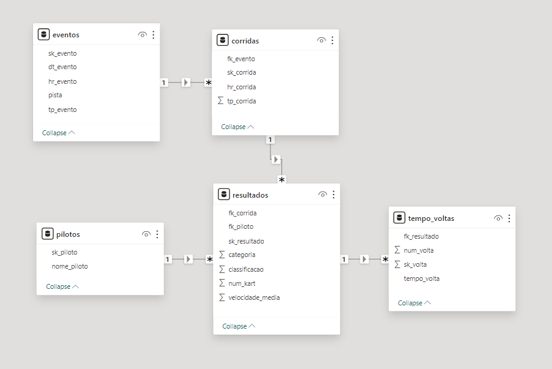

# Resultados Kart

Na área de dados a capacidade de responder perguntas é uma coisa que me encanta, sejam aquelas que podem mudar o rumo de uma empresa ou mesmo aquelas apenas para matar uma curiosidade.

A pergunta da vez foi como me sai pilotando um kart, para responder essa extrai os dados dos últimos anos no site do kartódromo com o Python e experimentei pela primeira vez o DuckDB para manipular os dados.

## Base

A base de dados extraídas possui dados do ano de 2022 até o início de 2024, os nomes dos pilotos foram substituídos. Com ela consegui levantar os melhores tempo de volta, velocidade média, quantidade de pilotos e muito mais.

#### Eventos (eventos.csv)
Dimensão com as informações do evento em que a corrida é organizada.

* <b>sk_evento</b>: chave única que identifica o evento
* <b>dt_evento</b>: data do evento
* <b>hr_evento</b>: hora de início do evento
* <b>pista</b>: traçado escolhido 
* <b>tp_evento</b>: identifica se foi um evento aberto ao público ou organizado por um grupo fechado. 
  - 0 - Aberto 
  - 1 - Fechado 

#### Corridas (corridas.csv)
Relaciona com a tabela de eventos e separa a corrida classificatória da corrida oficial.

* <b>sk_corrida</b>: chave única que identifica a corrida
* <b>fk_evento</b>: chave que relaciona com a tabela de eventos
* <b>tp_corrida</b>: identifica a corrida inicial para tomada de tempo e a oficial
    - 3 - Classificatória
    - 4 - Corrida oficial
* <b>hr_corrida</b>: data e hora de início da corrida

#### Pilotos (pilotos.csv)
Dimensão com os pilotos que participaram dos eventos.

* <b>sk_piloto</b>: chave única que identifica o piloto
* <b>nome_piloto</b>: nome do piloto

#### Resultados (resultados.csv)
Relaciona com a tabela de corridas e traz a classificação do piloto, categoria e velocidade média na prova.

* <b>sk_resultado</b>: chave única que identifica cada resultado
* <b>fk_corrida</b>: chave que relaciona com a tabela de corridas
* <b>fk_piloto</b>: chave que relaciona com a tabela de pilotos
* <b>categoria</b>: identifica a categoria que o piloto correu
    - 1 - Kart 13 HP
    - 2 - Outras categorias
* <b>num_kart</b>: número de identificação do kart.
* <b>classificacao</b>: posição que o piloto finalizou a prova
* <b>velocidade_media</b>: velocidade média do piloto na prova

#### Tempo de voltas (tempo_voltas.csv)
Relaciona com a tabela de resultados com todos os tempos de volta por piloto em cada prova.

* <b>sk_volta</b>: chave que identifica a volta
* <b>fk_resultado</b>: chave que relaciona com a tabela resultado
* <b>num_volta</b>: número da volta
* <b>tempo_volta</b>: tempo em que a volta foi finalizada

